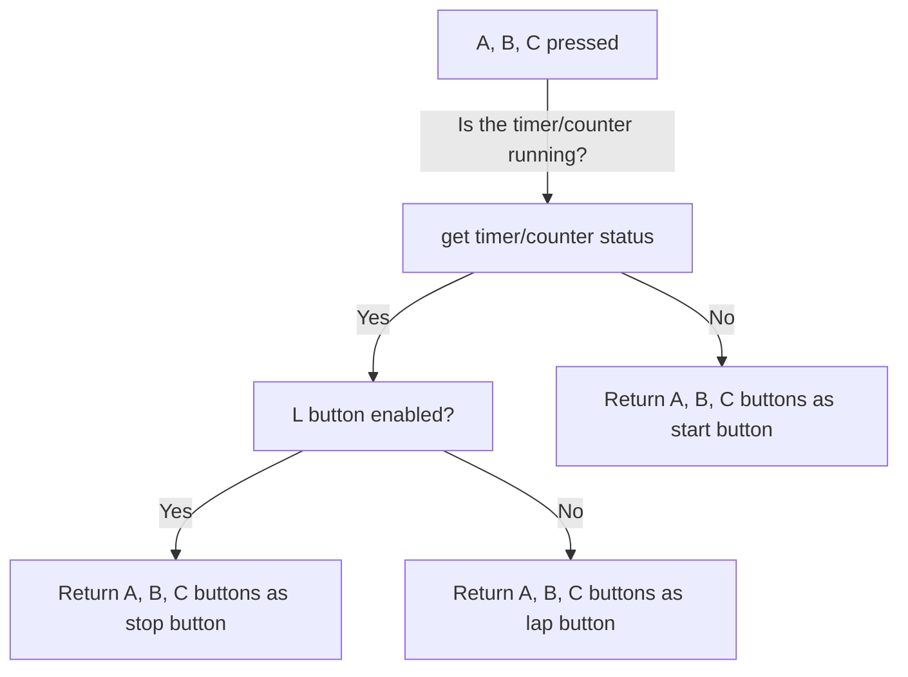

# Timer/Counter Program

This is a timer/counter program for Arduino Uno. It utilizes buttons as inputs, a buzzer as an indicator, and an LCD I2C 1602 display to provide user interface and display functionality. The program allows you to start, lap, and stop the timer/counter, and it calculates the shortest total time recorded.

## Hardware Requirements

To run this program, you will need the following hardware components:

- Arduino Uno board
- 4 buttons (A, B, C, L)
- Buzzer
- LCD I2C 1602 display

## Wiring Instructions

Please follow these wiring instructions to connect the hardware components to the Arduino Uno:

- Connect the A button to pin 2
- Connect the B button to pin 3
- Connect the C button to pin 4
- Connect the L button to pin 5
- Connect the buzzer to pin 6
- Connect the SDA pin of the LCD I2C module to the SDA pin of the Arduino Uno (A4)
- Connect the SCL pin of the LCD I2C module to the SCL pin of the Arduino Uno (A5)

## Libraries Required

This program utilizes the following libraries:

- Wire.h (for I2C communication)
- LiquidCrystal_I2C.h (for controlling the LCD display)

Make sure you have these libraries installed in your Arduino IDE before uploading the program.

## Program Flowchart

The program follows the flowchart shown below:

## Usage

1. Connect the hardware components as per the wiring instructions mentioned above.
2. Open the Arduino IDE and upload the program to your Arduino Uno.
3. Power on the Arduino Uno.
4. The LCD display will show "Ready" as the initial status.
5. Press A, B, or C buttons to start the timer/counter.
6. While the timer/counter is running, press A, B, or C buttons to record a lap.
7. Press the L button to change the function of A, B, and C buttons to stop.
8. When stopped, the LCD display will show the fastest button, lap count, and total time.
9. Repeat the process to start a new timer/counter session.

## Notes

- Make sure to adjust the pin numbers in the code according to your actual wiring.
- Please review and test the code thoroughly before deploying it in your project.
